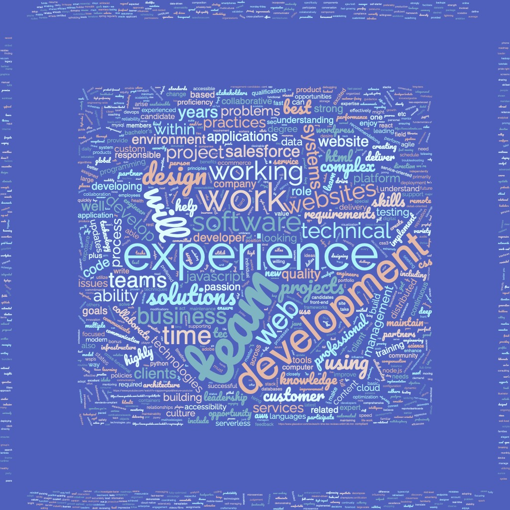

Week 4
Personality assessment: Logistician ISTJ-A
 
Strengths: Marketing/Design background, creative, highly organized
 
Weaknesses: Asking questions/getting help, avoiding conversations, entry level experience
 
Opportunities: design, familiar with marketing things, diverse amateur skill set (videography, photography, adobe products, different marketing programs, ++ coding)
 
Threats: unfamiliar with Boise companies, finances, I refuse to be a slave to work, I won’t have prior work experience going into the software development field

Week 5
10 companies
1. https://www.thrivewebdesigns.com
 
2. https://thesovrn.com/
 
3. https://www.intimetec.com/
 
4. https://www.accenture.com/
 
5. https://www.wsp.com/en-US/
 
6. https://www.livenation.com
 
7. https://www.vacasa.com
 
8. https://www.rei.com
 
9. https://www.allata.com
 
10. https://www.bequad.com
 
 
10 job openings
1. https://www.thrivewebdesigns.com/careers/
 
2. https://116andwest.com/careers/front-end-developer/
 
3. https://www.linkedin.com/jobs/view/3032446403/?alternateChannel=search&refId=iQ8E2IKeK6TC7lvLpoAv6g%3D%3D&trackingId=sdfFvoh8C7d4W9fkLjyqIg%3D%3D
 
4. https://www.linkedin.com/jobs/view/3050018702/?alternateChannel=search&refId=iQ8E2IKeK6TC7lvLpoAv6g%3D%3D&trackingId=XrF4gYSxrn70regxVngbXw%3D%3D
 
5. https://www.linkedin.com/jobs/view/2839655224/?alternateChannel=search&refId=iQ8E2IKeK6TC7lvLpoAv6g%3D%3D&trackingId=5se6A8%2FVdKa%2BD%2FW5SRUoKw%3D%3D
 
6. https://www.linkedin.com/jobs/view/3046957093/?alternateChannel=search&refId=n5Jso3vPqBcUhWxeTSnh7Q%3D%3D&trackingId=X1jJwcXShKGvYrdcXa7iWA%3D%3D
 
7. https://rei.jobs/careers/JobDetail/Sr-Software-Engineer-Community/23116
 
8. https://www.linkedin.com/jobs/search/?currentJobId=3040391989&distance=50&f_E=2&f_JT=F&geoId=102381687&keywords=fullstack%20software%20engineer&location=boise%20idaho%20united%20states&start=100
 
9. https://www.allata.com/open-positions
 
10.https://www.indeed.com/cmp/Scandinavian-Designs---Dania-Furniture?from=mobviewjob&tk=1g1o58hlg2eoq000&fromjk=f3e8e0a3e837faba&attributionid=mobvjcmp
 
 
Contacts:
- company: Accenture - contact: https://www.linkedin.com/in/nik-biebighauser/
 
- company: InTimeTec - contact:  https://www.linkedin.com/in/neil-whited-a126241/
 
- compnay ThriveWebDesigns - contact: https://www.linkedin.com/search/results/people/?currentCompany=%5B%222459315%22%5D&origin=COMPANY_PAGE_CANNED_SEARCH&sid=fTm
 
- company Sovrn - contact: https://www.linkedin.com/company/sovrn-creative/people/
 
- company - WSP - contacts:
https://www.linkedin.com/in/maureen-o-neill-shrm-cp-phr-57391b8/
https://www.linkedin.com/in/adelaide-barnhart-1677b989/
https://www.linkedin.com/in/clarke-white-83248813/
 
- company - LiveNation - contacts:
https://www.linkedin.com/in/marissa-tong/
 
- company - vacasa - contacts: 
https://www.linkedin.com/in/stephaniecurtiss/
 
8.company - rei - contacts https://www.linkedin.com/in/samarastrba/
https://www.linkedin.com/in/victoria-b-133a8629/
 
9. allatta - contacts
https://www.linkedin.com/in/jacob-posey-phr-sphr-5970199a/
https://www.linkedin.com/in/darryl-kilzer-jr/
 
10.be quad - contacts
https://www.linkedin.com/in/coripickard/

 
week 8
 
Three Reccomenders: Jade(previous boss), Jenn(previous boss), Brandon(previous colleague)
 
custom message sample:
 
Hi _____ , I noticed we're both attended Boise CodeWorks and you work at _____. I've heard about ______ company and was interested and learning about their working atmosphere. I'd love to connect and talk with you.
 
Connections:
Zac, austin, Toby, dylan, Mykeal, Jack, Ty, Tamara, Gage, Gavin, Katie, Isaiah, Harrison, Zach, Mark, Drake, Haven, Mick, Jeremy, Sam, 
 
Linkedin: https://www.linkedin.com/in/maria--walker/
 

